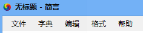
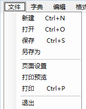
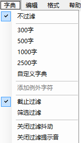
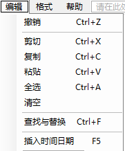
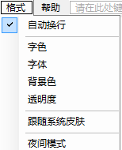
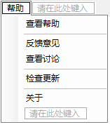
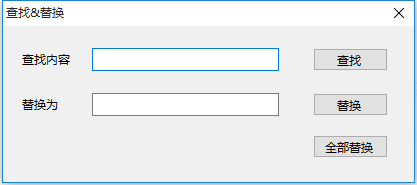
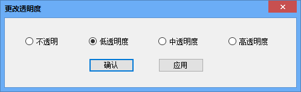
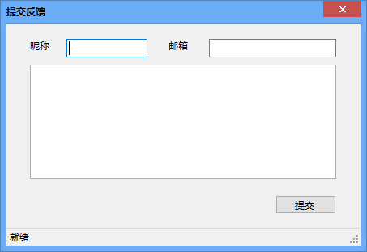

# 简言

## 软件简介

### 背景和意义

爱因斯坦曾说：“如果你无法向6岁孩童解释清楚，那说明你自己也不明白。”人们有时难免将简单的事情说复杂，简言就是一款让人们用简单的话表达清楚的软件。它通过过滤，令文本只留有预置的常用汉字。使用这款软件可以让我们的文字、语言的交流更简单。

### 需求分析

当人们给刚识字的小孩组一些简单的句子、给小朋友们准备一场演讲、给外国友人说明一件事情、给老人用明了的话语解释清楚，人们会对于措辞感到犹豫，由于不清楚对方熟悉哪些汉字，常常会让人感到言不达意。这时，我们便需要这一款按照常用字简化语言的软件了。

## 功能介绍

简言不仅仅是一款简化文字的软件，更是一款美观而功能完备的文本编辑器。其内置了打印文件、过滤文字、更换皮肤、设置外观、检查更新的等功能。详细说明如下：

1. 文件处理类：新建、打开文件，保存、另存，页面设置，打印预览，打印。
2. 字典过滤类：选择不同字数的常用字典，自定义字典，根据字典过滤非常用字，添加人名地名等例外字，设置人性化的过滤提示（抖动+声音）。
3. 编辑类：常用编辑指令，查找与替换，插入时间日期。
4. 格式类：设置字体、字色，背景色，透明度，夜间模式，换肤。
5. 帮助类：查看帮助，在线反馈意见，进入讨论区交流，检查更新。

## 程序设计

界面上以简洁大方为主，文本框上方插入菜单栏，功能接口位于菜单栏上。

文件列表中的，打开、保存、页面设置、打印预览、打印分别调用 OpenFileDialog、SaveFileDialog、PageSetupDialog、PrintPreviewDialog、PrintDialog 实现。其中对打印过程进行基于页面设置的限定，使文本多页打印、边距合适。
                

				
字典列表中展示的过滤功能，通过检测 RichTextBox 中内容的边框触发过滤行为，不再预置的字符串中的非法字符将会被截取过滤或筛选过滤掉。截取过滤是指，非法字符之后的字符都被删除，筛选过滤则仅将非法字符本身去除。抖动和声音效果通过简单的窗体移动和 Beep 功能实现。
    

	
	

编辑列表中的查找与替换使用了 InStr 和 Replace 等函数。插入时间运用了 Now.ToShortTimeString。并对左右文本识别，重新给 RichTextBox 赋值。
格式列表中的字色、背景色调用了 ColorDialog 窗口，字体调用了 FontDialog，透明度通过修改窗体Opacity属性实现。夜间模式提供了一个经测试较为护眼的配色方案。
 

帮助列表中的查看帮助和查看讨论通过内置 WebBrowser 实现，反馈意见通过代码自动填写网页表单实现，检查更新通过解析网站 RSS 文件显示。

## 使用说明书

下面对本软件的某些功能详细讲解。

1. 过滤功能的使用：首先在字典选项卡中，选择内置字典或者自定义字典，其中，自定义字典需要用户提供一个 UTF-8 编码的 TXT 文本文档，注意：文档中应包含常用标点、空格等。
点选选项卡中的截止过滤、筛选过滤可以切换过滤形式。

2. 查找与替换功能：在查找与替换对话框中。
 
通过多次点击查找按钮，可以实现“查找下一个”的功能，而替换按钮将从文档能查找到的第一个匹配字符开始替换。

3.调整外观

格式选项卡中点选透明度，则可选择窗体透明度。
 
点选应用按钮可以预览效果，确定则生效。四个选项的不透明度依次为 100%、95%、90%、85%。

4.反馈意见

帮助选项卡中点击反馈意见，则弹出反馈意见的对话框。用户填写三个必要信息后，程序将自动提交，提交按钮变成退出键。
 

 
5.检查更新

帮助选项卡中点击检查更新，则可以开始联网检查。如果有新版本，会显示下载更新的按钮，点击后呼出系统默认浏览器进行下载。

## 总结及进一步完善建议

简言目前的功能大体完备，不仅有基础文件处理的功能，也能满足文本编辑的需要，更可以提供一个较为舒适的编辑环境，也具备后续的技术支持的手段。软件可以满足日常使用。
进一步完善的建议：通过改善过滤程序段，提供常用英文单词的字典识别及过滤的功能，此功能或可在后续推出，请关注更新。

